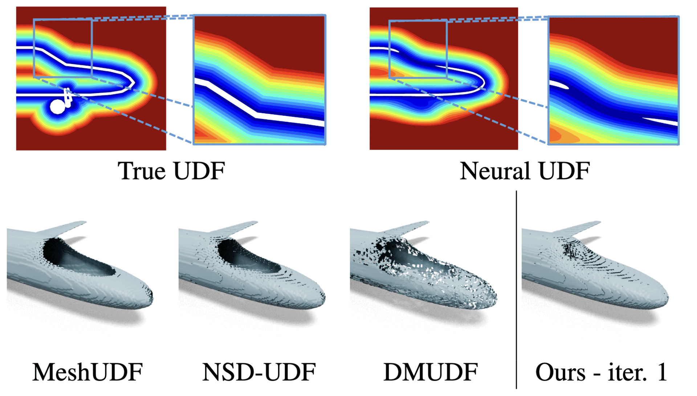

# High Resolution UDF Meshing via Iterative Networks

[Project page](https://ilceltico.github.io/hrudf/) | [ArXiv](https://arxiv.org/abs/2509.17212)

Pytorch implementation of the NeurIPS 2025 paper "High Resolution UDF Meshing via Iterative Networks", Federico Stella, Nicolas Talabot, Hieu Le, Pascal Fua. École Polytechnique Fédérale de Lausanne (EPFL), Switzerland.




To output this shape, run the example file with grid resolution 512. It is the second plane shape.

## Installation
### Step 1
For the code to work, you need:
```
Python
Numpy
Pytorch
Trimesh
Cython
Libigl
Setuptools
Tqdm
```

Alternatively, you can find my Conda environment for macOS in [requirements_macos_conda.txt](requirements_macos_conda.txt), and my Pip package list for CUDA in [requirements_cuda_pip.txt](requirements_cuda_pip.txt).  
**NOTE**: A GPU is not required to run the code, but of course it speeds up the execution.

### Step 2
Compile the Cython implementation of Marching Cubes if you intend to use it. Make sure to specify the path to your Numpy installation.
```
cd custom_mc
export CFLAGS="-I path_to_numpy/core/include/ $CFLAGS"
python setup.py build_ext --inplace
```

To use DualMesh-UDF, see below.


## Usage
A runnable and fully commented usage example is provided in the file [example_extract_meshes.py](example_extract_meshes.py), which extracts meshes from pre-trained auto-decoders. To run it, download our zipped auto-decoders `example_neural_UDFs.zip` from [here](https://zenodo.org/records/22032509/files/example_neural_UDFs.zip?download=1) and extract it in the root of the repository. You can also find the training GT shapes for the audo-decoders [here](https://zenodo.org/records/22032509/files/datasets.zip?download=1).  
Run the example with
```
python example_extract_meshes.py --resolution 256 --device [cpu|cuda|mps] --dataset [planes|cars|chairs]
```

### Tutorial
To run our algorithm on your own neural UDFs, in practice, you only need to do four things:

1. Load our pre-trained weights, the same as in the paper, with:
    ```
    model, config = utils.load_model("weights/model.pt", device)
    ```
    These pre-trained weights are used for all the main experiments in the paper.
2. Define a function `udf_and_grad_f`

    You can find examples in [example_extract_mesh.py](example_extract_mesh.py).

    This function computes the UDF and the gradients for `N` input query points. Expected output shapes are `(N)` for the UDF and `(N,3)` for the gradients. The function will be automatically wrapped in a batching mechanism.
    
    **NOTE**: if possible, we suggest normalizing the input meshes to a [-1,1] bounding box, which is usually done before training a neural UDF; it is not a mandatory step, but it should improve performance since our model was trained with such assumption.
3. Compute the pseudo-SDFs iteratively with:
    ```
    pseudo_sdfs = compute_pseudo_sdf(
        model, 
        recursion_type=config['recursion_type'], 
        udf_and_grad_f=lambda query_points: your_neural_udf_function(query_points),
        n_grid_samples=resolution, 
        num_recursions=5, # We suggest 5 for noisy networks, and 2-3 for more precise ones
        batch_size=10000,
        batch_size_pseudosdf=10000,
        clamp_distance=your_clamp_distance, # The clamping distance of your neural UDF network
        export_recursions="last", # Set to "all" if you want to see the evolution of the pseudo-sdf over the iterations
        )
    ```
    with the desired resolution. The batch size can be adjusted to avoid excessive memory usage.  
    It returns a **list** of pseudo-SDFs.

    **Note**: the output is a list of the requested iterations (all, or only the last one), each of which has shape `(resolution-1, resolution-1, resolution-1, 8)`, because it contains a sign configuration for each grid cell. It is not a true SDF, hence the name. This means that SDF-based algorithms should be slightly modified to retrieve the signs correctly.
4. Mesh the output.

    The output can be meshed using Marching Cubes, which we provide with a slight interface modification to accept our Pseudo-SDF input. You can mesh it with a different algorithm and a corresponding interface modification.
    ```
    pseudosdf_mc_mesh = mesh_marching_cubes(pseudo_sdfs[-1])
    ```

## Integration with [DualMesh-UDF]((https://github.com/cong-yi/DualMesh-UDF))
We provide here a modified version of DualMesh-UDF with relaxed heuristics. All rights of the code to the original authors!
### Install
```
cd DualMesh-UDF
pip install .
```

### Usage
DualMesh-UDF requires two functions: one that extracts the UDF and one that extracts the UDF and the gradients. You can see examples in [example_extract_mesh.py](/example_extract_mesh.py).
Then you can call:
```
dmudf_mesh, pseudosdf_dmudf_mesh = mesh_dual_mesh_udf(pseudo_sdfs[-1], lambda query_points: udf_f_dmudf(query_points, gt_mesh), lambda query_points: udf_grad_f_dmudf(query_points, gt_mesh), batch_size=args.batch_size, device=args.device)

```
The first mesh is extracted by the original DualMesh-UDF directly from the UDF. The second mesh is extracted using the information from the Pseudo-SDF. Try to mesh a ShapeNet Car to see the difference!

Note that DualMesh-UDF requires grid sample resolutions of `2^k+1`, otherwise it won't work. E.g. `129`, `257`, `513`.

## Training
If you want to train your own network you will need a watertight dataset, because the SDF is needed as ground truth for the training. In the paper we used the first 80 shapes from the first chunk of ABC, which you can download [here](https://zenodo.org/records/22032509/files/datasets.zip?download=1). Extract the zip file `datasets.zip` in the root of this repository. You can also find the full ABC dataset [here](https://deep-geometry.github.io/abc-dataset/), in case you want to train with a different training split.

1. Pre-process the data to speed up the training phase. It should take 5-10 minutes, and it does not use a GPU.
    ```
    create_dataset.py
    ```
    This script will extract the UDF and SDF of the ABC dataset on a fixed grid. As global variables in the script you can set the grid resolution(s) (128 in the paper), the dataset location and the list of shapes to use from the specified dataset. The list of ABC shapes used in the paper is in [datasets/abc_obj_list_train_80.txt](/datasets/abc_obj_list_train_80.txt). The script will use the first 80% of the list as training (corresponding to exactly 80 shapes in our list), and the rest as validation.

2. Train the network. 
    ```
    train.py --device [cpu|mps|cuda]
    ```

    It should take around 2h on a recent CUDA-capable GPU and requires 40 GB of VRAM using our default settings. You can run it on CPU or MPS with the `device` argument if you don't have enough VRAM, but it will be 5-10x slower.

    There are many other command line arguments, which you can find inside the script. By default, it uses the same parameters as in the paper.


## Bibtex
If you find this work useful, please cite us!
```
@inproceedings{
    stella2025high,
    title={High Resolution {UDF} Meshing via Iterative Networks},
    author={Federico Stella and Nicolas Talabot and Hieu Le and Pascal Fua},
    booktitle={The Thirty-ninth Annual Conference on Neural Information Processing Systems},
    year={2025},
    url={https://openreview.net/forum?id=i7vgeipxNf}
}


```